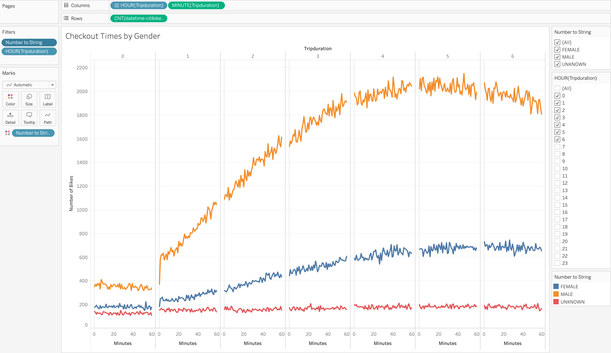
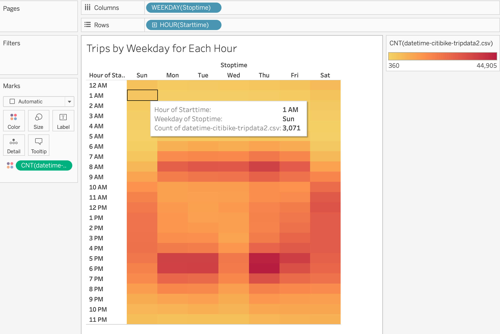
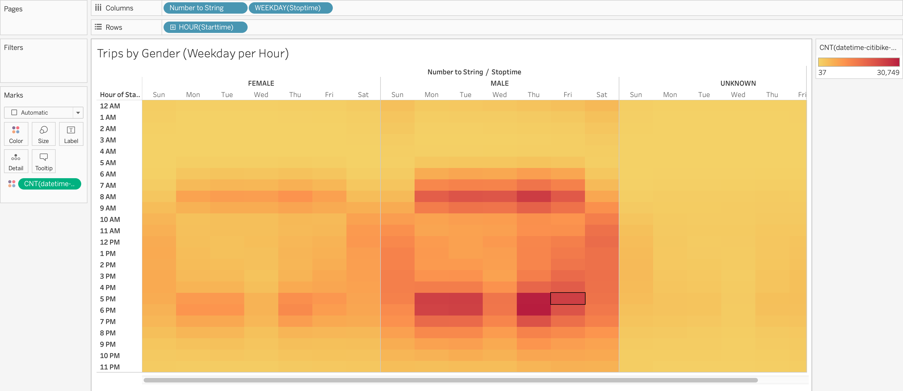
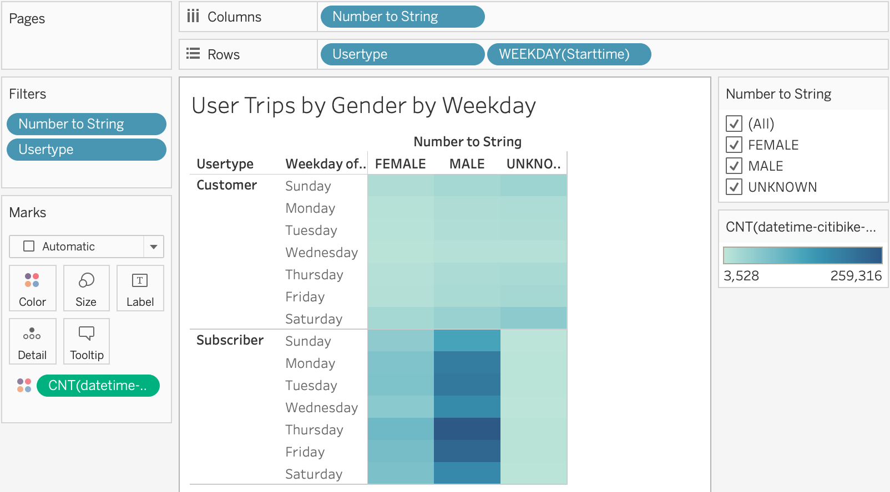
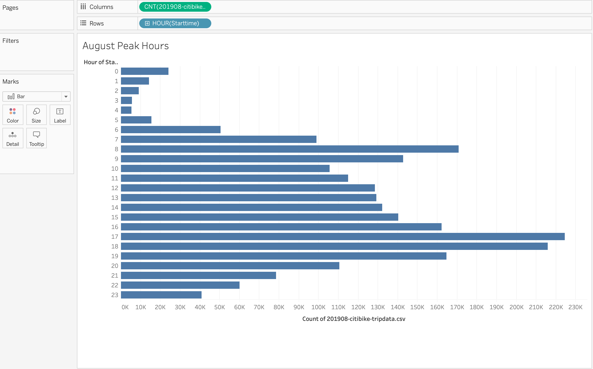
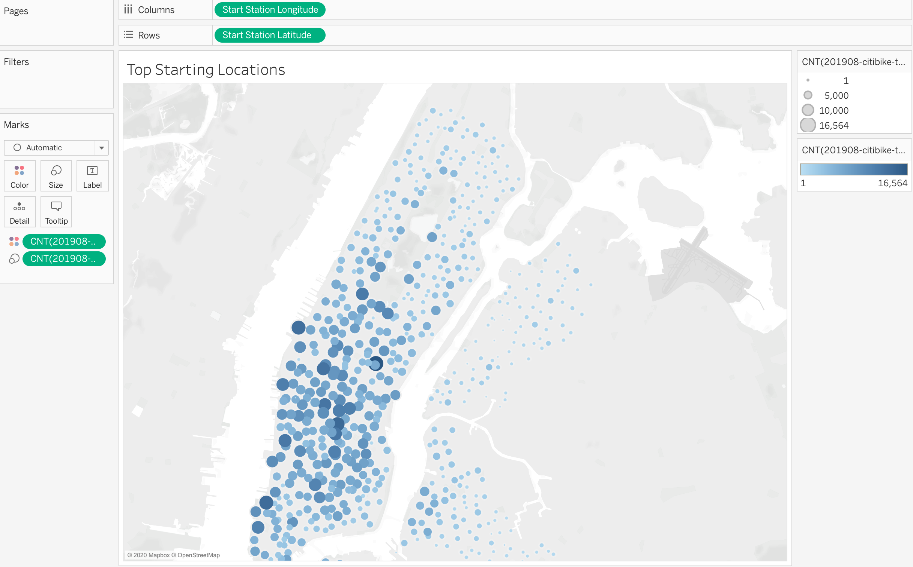

# bikesharing

## Overview of the analysis: 
This analysis project was undertaken to look at the potential of starting a bikesharing service in Des Moines, based on the Citibike bikesharing operation in New York City. We look at several aspects of the Citibike program, starting with a dataset containing over 2.3 million data points for bikeshare rides in New York during August of 2019. We use Tableau Public, Jupyter Notebook and VS Code to pull, transform and analyze the data and create several visualizations to help inform potential investors in this project.

## Results: 
Using the Citibike data available for August of 2019, we highlight some interesting insight into bike sharing services. Using Tableau we built visualization that show: 
* Bike usage: the length of time bikes were checked out
* Gender breakouts
* Hours of the day and days of the week bike usage 
* Most used bike station locations across the Citibike coverage area

 
Here we see the length of time that Citibikes are checked out by all users. Checked out times between 4 and 6 hours have the highest number of Bikes in use.

 
Looking at differences in the Gender of users using Citibikes, we see significantly more Males than Females using bikes in August. The highest numbers of bikerides have durations between 3 and 7 hours- a pattern that holds acrosss genders albeit with a difference in magnitude.  

 
This heatmap really emphasizes the heavier bike use hours, with work schedules likely contributing to a morning surge in trips, really taking off at 6am and slowing some by 10am. The after-work surge starts picking up at 4pm and tapers by 9pm. The highest trip counts occur in the afternoon/evenings during the week. On weekends, bike usage is spread out more evenly although at lower magnitudes than peak-weekday hours.

 
We see a similar pattern of bike usage between genders and we can see the higher male usage in the darker shades. Interestingly, Wednesday afternoon/evenings are not as popular and Thursdays evenings have the most trips.

 
More men are subscribers in general, and we again see that Thursdays are the highest trip weekday.

 
This visualization shows that the peak Citibike usage hours are between 8am and 10am in the morning and between 4pm and 8pm in the evening. 

 
Here we can see the starting locations for all of the August bikesahre rides taken in New York. The more popular start locations are highlited by darker and larger circles on the map of New York City. 

## Summary: 
The key takeaways from this analysis are that most bikesharing trips occur on weekdays, with concentrations around work schedules. Bikeshare use is spread out more evenly during the day on weekends.  Bike repair and maintenance should probably be done when usage is lowest- late nights up until dawn. More bike users are male and there are more subscribers than non-subscribed customers.

### LINK to TABLEAU PUBLIC STORY
[link to dashboard](https://public.tableau.com/profile/alex.arellano7163#!/vizhome/NYCCitibikeAnalysisChallenge14/NYCCitibikeanalysis)