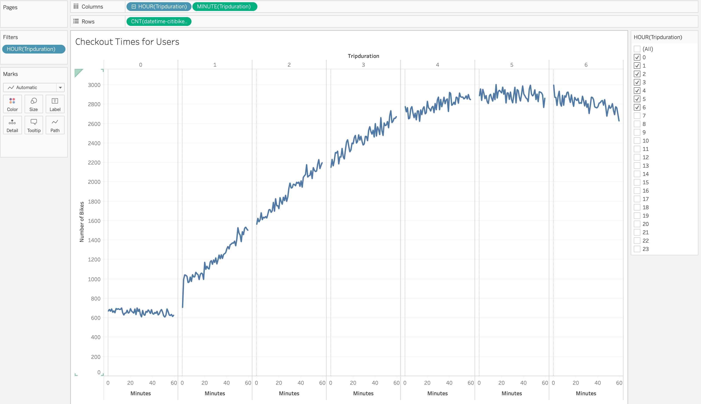

# bikesharing

## Overview of the analysis: 
This analysis project was undertaken to look at the potential of starting a bikesharing service in Des Moines, based on the Citibike bikesharing operation in New York City. We look at several aspects of the Citibike program, starting with a dataset containing over 2.3 million data points for bikeshare rides in New York during August of 2019. We use Tableau Public, Jupyter Notebook and VS Code to pull, transform and analyze the data and create several visualizations to help inform potential investors in this project.

## Results: 
Using the visualizations you have in your Tableau Story, describe the results of each visualization underneath the image.

 
Here we see the length of time that Citibikes are checked out by all users. Checked out times between 4 and 6 hours have the highest number of Bikes in use.

 
Looking at differences in the Gender of users using Citibikes, we see significantly more Males than Females, although there is a similar pattern between the genders.  

 
There is a description of the results for each visualization (7 pt)

 
There is a description of the results for each visualization (7 pt)

 
There is a description of the results for each visualization (7 pt)

 
This visualization shows that the peak Citibike usage hours are between 8am and 10am in the morning and between 4pm and 8pm in the evening. 

 
Here we can see the starting locations for all of the August bikesahre rides taken in New York. The more popular start locations are highlited by darker and larger circles on the map of New York City. 

## Summary: 
Provide a high-level summary of the results and two additional visualizations that you would perform with the given dataset.

LINK to TABLEAU PUBLIC STORY
[link to dashboard](https://public.tableau.com/profile/alex.arellano7163#!/vizhome/NYCCitibikeAnalysisChallenge14/NYCCitibikeanalysis)